# EF — Reporte de Proyecto
**Estudiante:** Ugarte Nicole**Proyecto:** Hotel Pequeño
**Repositorio:** https://github.com/nicoleUg/backHotel.git
**Fecha de entrega:** 13/06/2026

---

## Sección 1 — Deploy

**URL del proyecto:** https://hotel.leleworks.dev/
**Swagger / API:** https://backhotel-yxaz.onrender.com/api

> Captura del proyecto corriendo con datos reales:

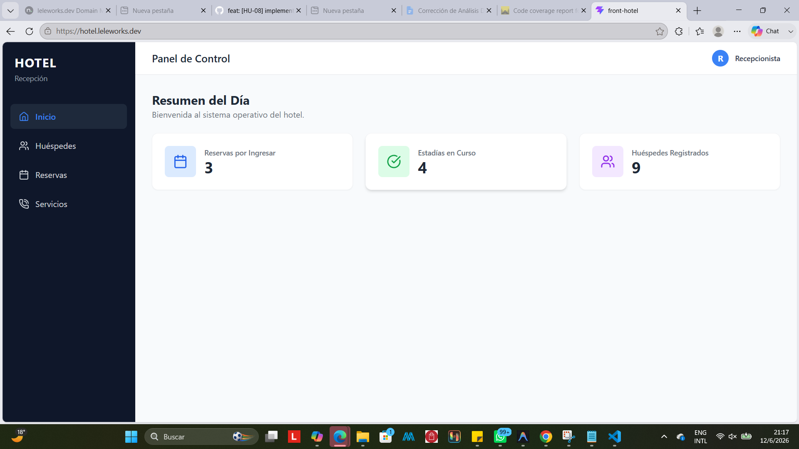
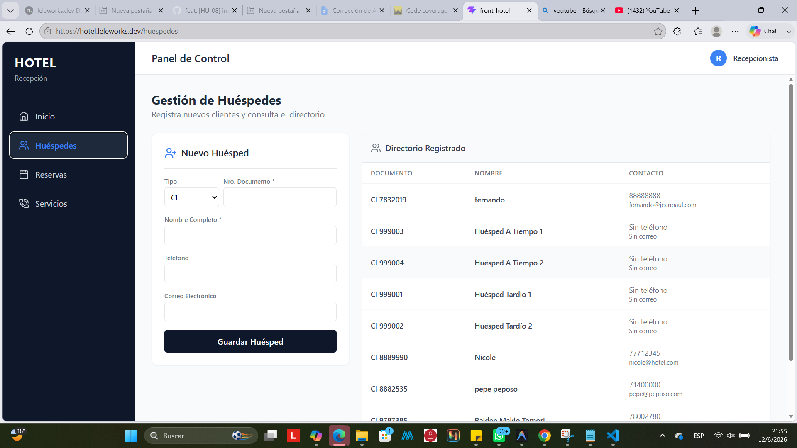
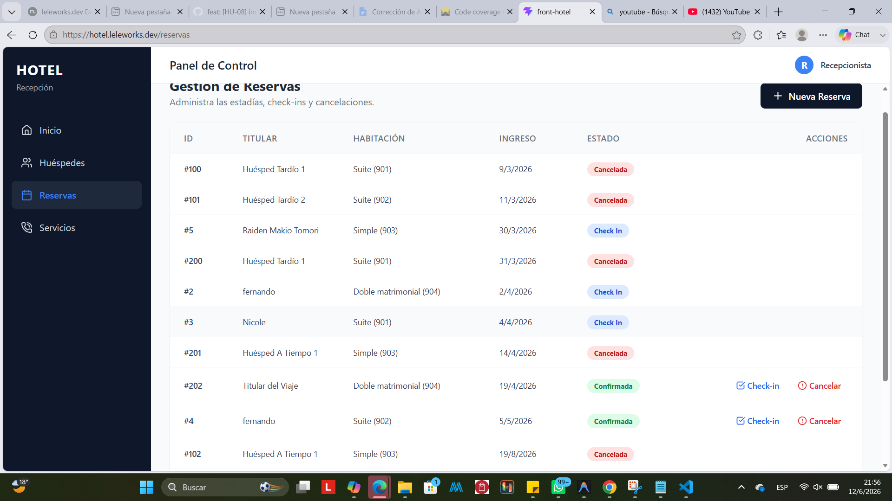
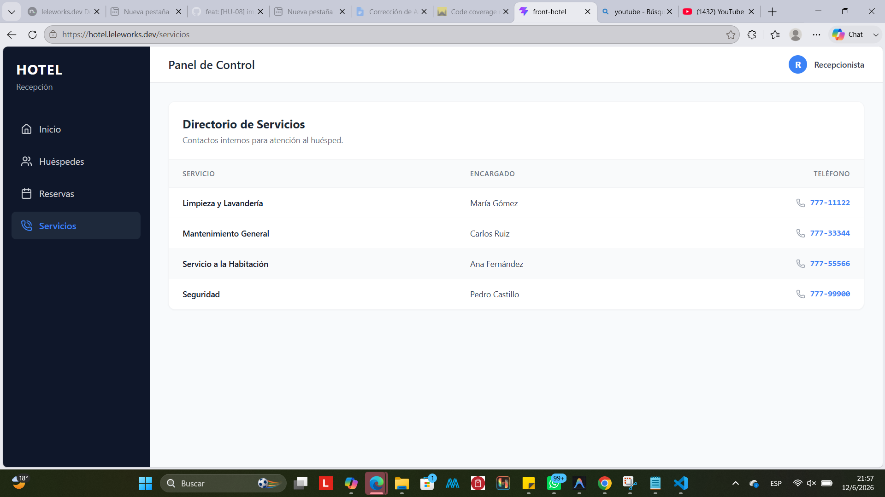


---

## Sección 2 — Pruebas con TDD + cobertura

### Cobertura inicial (42.3%)

**Herramienta:** Jest comando npm run test:coverage


> Captura del reporte de cobertura antes de escribir pruebas nuevas:

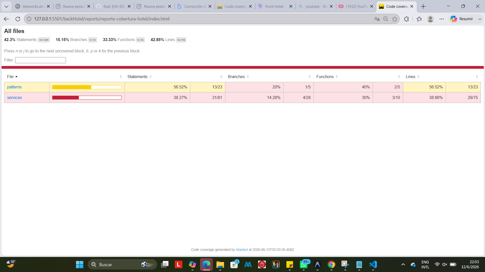

---

### Ciclo TDD — Prueba 1

**HU:** [HU-08] Descuento por Larga Estadía
> Como administrador quiero aplicar un descuento automático del 10% sobre la tarifa total para las reservas de 7 noches o más, incentivando estadías largas.

**CA elegido:**Dados el número de días de estadía y el precio por día, si los días son mayores o iguales a 7, el sistema debe retornar el total con un 10% de descuento aplicado.

**Commit 1 — Rojo** [`a53374e`](https://github.com/nicoleUg/backHotel/commit/a53374ef3eea9d4287ade7a5191d370e31a47b61):
```
test: [HU-08] agregar test para calculo de descuento por larga estadia
```
Test escrito (sin el código que lo pase aún):
```typescript
describe('calcularTotalConDescuento', () => {
  it('debe aplicar un 10% de descuento si la estadia es de 7 o mas dias', () => {
    const total = calcularTotalConDescuento(7, 100);
    expect(total).toBe(630);
  });
});
```

> Captura del test fallando o error de compilación:

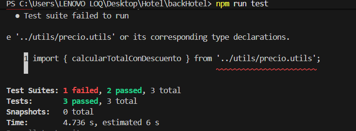

---

**Commit 2 — Verde** [`4020710`](https://github.com/nicoleUg/backHotel/commit/40207103cee47e4caf5a3574ba5102e4fcfc7611):
```
feat: [HU-08] implementar calcularTotalConDescuento
```
Código mínimo para hacer pasar el test:
``` typescript
export function calcularTotalConDescuento(dias: number, precioPorDia: number): number {
  const total = dias * precioPorDia;
  if (dias >= 7) {
    return total - (total * 0.10);
  }
  return total;
}
```

> Captura del test pasando:

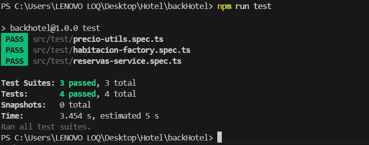

---

**Commit 3 — Refactor** [`92bfa33`](https://github.com/nicoleUg/backHotel/commit/92bfa33689f557b3d2c54b90dc8558bb98c64136):
```
refactor: [HU-08] limpiar y extraer limites de descuento a constantes en precio.utils
```
Cambios aplicados:
``` typescript
const LIMITE_DIAS_DESCUENTO = 7;
const TASA_DESCUENTO = 0.10;

export function calcularTotalConDescuento(diasEstadia: number, tarifaDiaria: number): number {
  const totalBase = diasEstadia * tarifaDiaria;
  return diasEstadia >= LIMITE_DIAS_DESCUENTO 
    ? totalBase * (1 - TASA_DESCUENTO) 
    : totalBase;
}
```

> Captura del test aún pasando después del refactor:

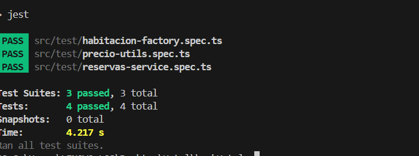

---

### Ciclo TDD — Prueba 2

**HU:** HU: [HU-09] Cobro por Personas Extra
> Como recepcionista quiero que el sistema calcule automáticamente un cobro adicional si la cantidad de huéspedes supera la capacidad base de la habitación, sin exceder el límite máximo.

**CA elegido:**Si se registran más personas que la capacidad base, el sistema cobrará 20.00 bolivianos por cada persona adicional. Si no la supera, el cobro extra es 0.

**Commit 1 — Rojo** [`874b718`](https://github.com/nicoleUg/backHotel/commit/874b718b420f081068aa1d8318e8118c17c611c3):
```
test: [HU-09] agregar test para cobro de huespedes adicionales
```
Test escrito (sin el código que lo pase aún):
```typescript

describe('calcularCobroPersonasExtra', () => {
  it('debe cobrar 20 bolivianos por cada persona extra sobre la capacidad base', () => {
    expect(calcularCobroPersonasExtra(4, 2)).toBe(40);
    expect(calcularCobroPersonasExtra(2, 2)).toBe(0);
  });
});
```

> Captura del test fallando o error de compilación:

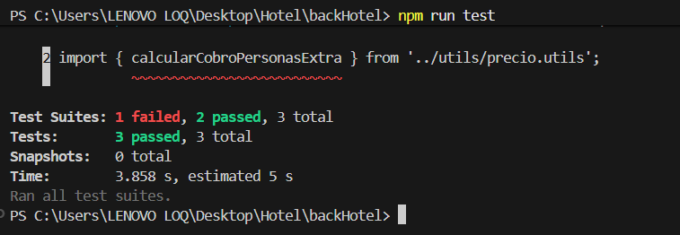

---

**Commit 2 — Verde** [`524408b`](https://github.com/nicoleUg/backHotel/commit/524408b909f7733c6c4dc44f41d9c936ad2cb5f4):
```
feat: [HU-09] implementar calcularCobroPersonasExtra
```
Código mínimo para hacer pasar el test:
``` typescript
export function calcularCobroPersonasExtra(personas: number, capacidad: number): number {
  if (personas > capacidad) {
    return (personas - capacidad) * 20;
  }
  return 0;
}
```

> Captura del test pasando:

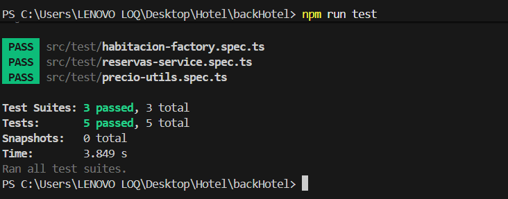

---

**Commit 3 — Refactor** [`5099f44`](https://github.com/nicoleUg/backHotel/commit/5099f44f2e5d5b815e1219580e03a1506c8bec52):
```
refactor: [HU-09] limpiar y usar constante para tarifa de persona extra y funcion math.max
```
Cambios aplicados:
```typescript
const TARIFA_PERSONA_EXTRA = 20.00;

export function calcularCobroPersonasExtra(personasRegistradas: number, capacidadBase: number): number {
  const personasExtra = Math.max(0, personasRegistradas - capacidadBase);
  return personasExtra * TARIFA_PERSONA_EXTRA;
}
```


> Captura del test aún pasando después del refactor:

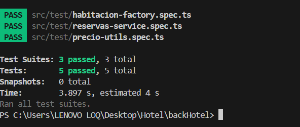

---

### Ciclo TDD — Prueba 3

**HU:** HU: [HU-10] Recargo por Late Check-out
> Como recepcionista quiero que el sistema calcule automáticamente un recargo si el huésped entrega la habitación después de la hora límite, para compensar el retraso en la limpieza.

**CA elegido:**Si el retraso es de 1 a 4 horas, se cobra 15bs por cada hora. Si el retraso es mayor a 4 horas, el sistema cobra automáticamente el equivalente a una noche completa de tarifa base.

**Commit 1 — Rojo** [`1291bff`](https://github.com/nicoleUg/backHotel/commit/1291bff18a6176070c3a39de50fdee883e53c742):
```
test: [HU-10] agregar test para calculo de recargo por late check-out
```
Test escrito (sin el código que lo pase aún):
```typescript
describe('calcularRecargoLateCheckout', () => {
  it('debe cobrar 15 por hora de retraso, o tarifa completa si supera las 4 horas', () => {
    expect(calcularRecargoLateCheckout(2, 100)).toBe(30);
    
    expect(calcularRecargoLateCheckout(5, 100)).toBe(100);
  });
});
```

> Captura del test fallando o error de compilación:

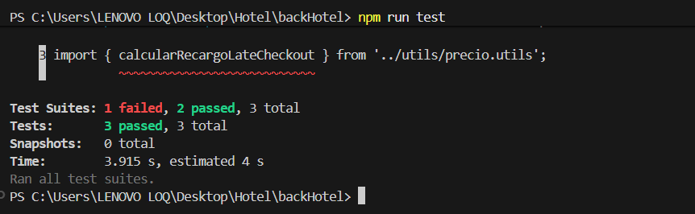

---

**Commit 2 — Verde** [`524408b`](https://github.com/nicoleUg/backHotel/commit/524408b909f7733c6c4dc44f41d9c936ad2cb5f4):
```
feat: [HU-10] implementar calcularRecargoLateCheckout
```
Código mínimo para hacer pasar el test:
``` typescript
export function calcularRecargoLateCheckout(horasRetraso: number, tarifaBase: number): number {
  if (horasRetraso > 4) {
    return tarifaBase;
  }
  if (horasRetraso > 0) {
    return horasRetraso * 15;
  }
  return 0;
}
```

> Captura del test pasando:

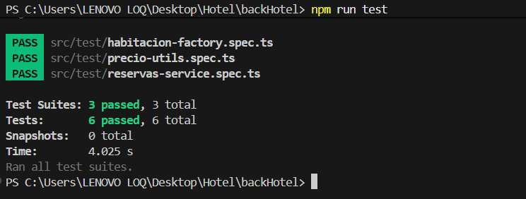

---

**Commit 3 — Refactor** [`93cee40`](https://github.com/nicoleUg/backHotel/commit/93cee40d38684bb5680f46a4f874340b46401263):
```
refactor: [HU-10] extraer limites de horas y tarifa por hora a constantes
```
Cambios aplicados:
```typescript
const LIMITE_HORAS_PARA_DIA_COMPLETO = 4;
const TARIFA_POR_HORA_RETRASO = 15.00;

export function calcularRecargoLateCheckout(horasRetraso: number, tarifaDiariaBase: number): number {
  if (horasRetraso <= 0) return 0;
  
  if (horasRetraso > LIMITE_HORAS_PARA_DIA_COMPLETO) {
    return tarifaDiariaBase;
  }
  
  return horasRetraso * TARIFA_POR_HORA_RETRASO;
}
```
> Captura del test pasando despues del refactor:

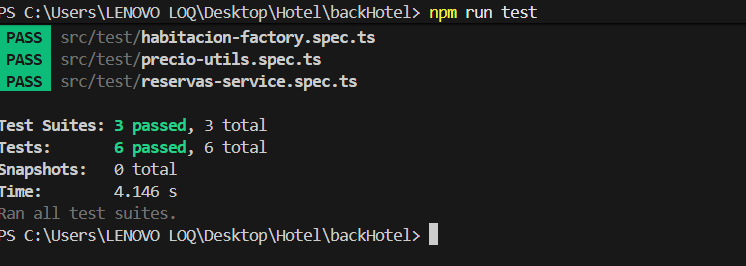
---

### Cobertura final

**Cobertura alcanzada:** 57.02%

> Captura del reporte de cobertura final:

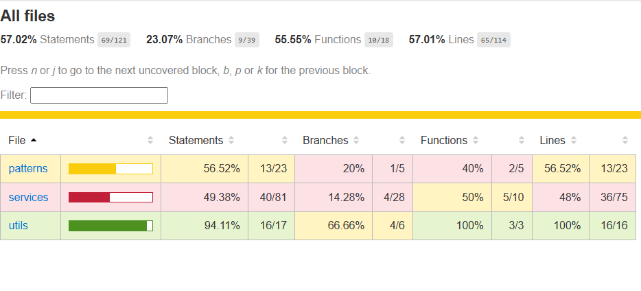

> Antes la cobertura era menor a 50 porque los unit test era priorizando los riesgos por casos criticos ahora es 57.02% porque tambien se vio de agregar nuevas funcionalidades

---

## Sección 3 — Code smells corregidos

Mínimo 3 nuevos (adicionales a los del EC2).

| # | Tipo | Commit | Descripción |
|---|---|---|---|
| 1 | Inseguridad de Tipos (Uso abusivo de any)| [`ecb3ab1`](https://github.com/nicoleUg/backHotel/commit/ecb3ab14794f3604b20eb1707e48317a574cb0f4) | Antes: Uso de as any para saltar validaciones de Jest. → Después: Tipado estricto de Mocks usando Partial<Record>. |
| 2 | Ejecución Duplicada en Aserciones| [`d6357f7`](https://github.com/nicoleUg/backHotel/commit/d6357f7550076883fe1511cf8cb6d1f2b81217e6) | Antes: Llamado asíncrono repetido crearReserva para asertar el error. → Después: Validación de tipo y mensaje en una sola ejecución. |
| 3 | Magic Numbers en pruebas | [`b135a4c`](https://github.com/nicoleUg/backHotel/commit/b135a4c9566b3181b617635cff09b7f9b02849e5) | [Antes: Valor de mora "50.00" repetido en aserciones. → Después: Reemplazo por constante MONTO_MORA_ESPERADO] |

### Detalle — Smell 1: Inseguridad de Tipos (Uso abusivo de any)

**Código antes:**
``` typescript
let reservasService: ReservasService;
  let reservasRepositoryMock: jest.Mocked<ReservasRepository>;

  beforeEach(() => {
    reservasRepositoryMock = {
      obtenerTodas: jest.fn(),
      buscarHabitacion: jest.fn(),
      existeSolapamiento: jest.fn(),
      crear: jest.fn(),
      buscarReservaPorId: jest.fn(),
      registrarCheckIn: jest.fn(),
      actualizarEstadoReserva: jest.fn(),
      guardarMora: jest.fn(),
    } as any;
    //...
      reservasRepositoryMock.buscarReservaPorId.mockResolvedValue(reservaMock as any);

```

**Código después:**
```typescript
let reservasRepositoryMock: Partial<Record<keyof ReservasRepository, jest.Mock>>;

  beforeEach(() => {
    reservasRepositoryMock = {
      obtenerTodas: jest.fn(),
      buscarHabitacion: jest.fn(),
      existeSolapamiento: jest.fn(),
      crear: jest.fn(),
      buscarReservaPorId: jest.fn(),
      registrarCheckIn: jest.fn(),
      actualizarEstadoReserva: jest.fn(),
      guardarMora: jest.fn(),
    };

    reservasService = new ReservasService(reservasRepositoryMock as unknown as ReservasRepository);
  });
  //...
      reservasRepositoryMock.buscarReservaPorId!.mockResolvedValue(reservaMock);
      reservasRepositoryMock.actualizarEstadoReserva!.mockResolvedValue(undefined);
      reservasRepositoryMock.guardarMora!.mockResolvedValue(undefined);

```

---

### Detalle — Smell 2: Ejecución Duplicada en Aserciones

**Código antes:**
```typescript
await expect(reservasService.crearReserva(dto)).rejects.toThrow(BadRequestException);
await expect(reservasService.crearReserva(dto)).rejects.toThrow('La fecha de salida debe ser estrictamente posterior...');
```

**Código después:**
```typescript
await expect(reservasService.crearReserva(dto as any)).rejects.toThrow(
  new BadRequestException('La fecha de salida debe ser estrictamente posterior a la fecha de ingreso.')
);
```

---

### Detalle — Smell 3: Magic Numbers en pruebas

**Código antes:**
```typescript
expect(resultado.montoMora).toBe(50.00);
      expect(reservasRepositoryMock.guardarMora).toHaveBeenCalledWith(
        1,
        50.00,
        expect.any(Date)
      );
```

**Código después:**
```typescript
const MONTO_MORA_ESPERADO = 50.00;

expect(resultado.montoMora).toBe(MONTO_MORA_ESPERADO);
expect(reservasRepositoryMock.guardarMora).toHaveBeenCalledWith(
  1,
  MONTO_MORA_ESPERADO,
  expect.any(Date)
);
```

---

## Sección 4 — Trazabilidad HU → CA → test

| # | Historia de Usuario | Criterio de Aceptación | Prueba que valida ese CA | Commit |
|---|---|---|---|---|
| 1 | [HU-08] Descuento Larga Estadía | Dado días de estadía / Cuando son >= 7 / Entonces descuenta 10% | calcularTotalConDescuento_EstadiaLarga_AplicaDescuento | [`92bfa33`](https://github.com/nicoleUg/backHotel/commit/92bfa33689f557b3d2c54b90dc8558bb98c64136) |
| 2 | [HU-09] Cobro por Personas Extra | Dado nro personas / Cuando supera base / Entonces cobra 20bs por extra | calcularCobroPersonasExtra_ExcedeBase_CobraDiferencia | [`5099f44`](https://github.com/nicoleUg/backHotel/commit/5099f44f2e5d5b815e1219580e03a1506c8bec52) |
| 3 | [HU-10] Recargo por Late Check-out | Dado horas retraso / Cuando es > 4 / Entonces cobra noche completa | calcularRecargoLateCheckout_RetrasoMayorA4_CobraDiaCompleto| [`93cee40`](https://github.com/nicoleUg/backHotel/commit/93cee40d38684bb5680f46a4f874340b46401263) |

### Cadena 1 — [HU-08] Descuento por Larga Estadía

**Historia de Usuario:**
> Como administrador quiero aplicar un descuento automático del 10% sobre la tarifa total para las reservas de 7 noches o más como incentivo a estadías largas.

**Criterio de Aceptación elegido:**
> Dada una reserva procesada / Cuando se constata que la cantidad de noches es de 7 o más / Entonces la función retorna el costo total menos el 10% de descuento.

**Prueba que valida este CA:**
```typescript
it('debe aplicar un 10% de descuento si la estadia es de 7 o mas dias', () => {
    // Arrange
    const diasEstadia = 7;
    const precioBase = 100;
    
    // Act
    const totalPagar = calcularTotalConDescuento(diasEstadia, precioBase);
    
    // Assert
    expect(totalPagar).toBe(630);
});
```

---

### Cadena 2 — [HU-09] Cobro por Personas Extra
**Historia de Usuario:**
> Como recepcionista quiero que el sistema calcule automáticamente un cobro adicional si la cantidad de huéspedes supera la capacidad base de la habitación, sin exceder el límite máximo.

**Criterio de Aceptación elegido:**
> Dado el cierre de reserva / Cuando se registran más personas que la capacidad base / Entonces el módulo financiero suma 20 bs multiplicados por la cantidad excedente.

**Prueba que valida este CA:**
```typescript
it('debe cobrar 20 bolivianos por cada persona extra sobre la capacidad base', () => {
    // Arrange
    const totalPersonas = 4;
    const capacidadBase = 2;

    // Act
    const cobroAdicional = calcularCobroPersonasExtra(totalPersonas, capacidadBase);

    // Assert
    expect(cobroAdicional).toBe(40);
});
```
---

### Cadena 3 — [HU-10] Recargo por Late Check-out
 
**Historia de Usuario:**
> Como recepcionista quiero que el sistema calcule automáticamente un recargo si el huésped entrega la habitación después de la hora límite, para compensar el retraso en la limpieza.

**Criterio de Aceptación elegido:**
> Dado el registro de salida del huésped (Check-out) / Cuando se reporta un retraso en la entrega de la habitación mayor a 4 horas / Entonces el sistema invalida el cobro por horas y aplica un recargo equivalente a una (1) noche de tarifa completa.

**Prueba que valida este CA:**
```typescript
it('debe cobrar la tarifa de un dia completo si el retraso supera el limite de horas', () => {
    // Arrange
    const horasTarde = 5;
    const precioHabitacion = 100;

    // Act
    const recargoGenerado = calcularRecargoLateCheckout(horasTarde, precioHabitacion);

    // Assert
    expect(recargoGenerado).toBe(100);
});
```